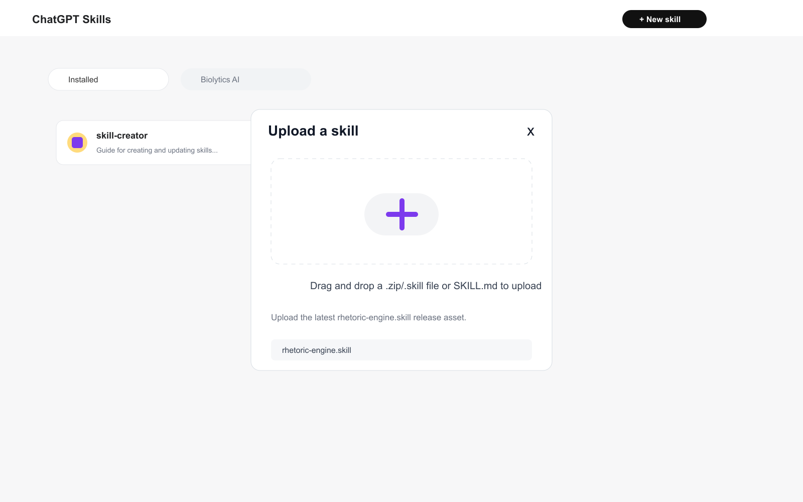
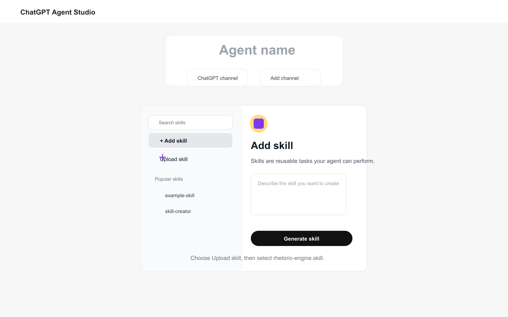
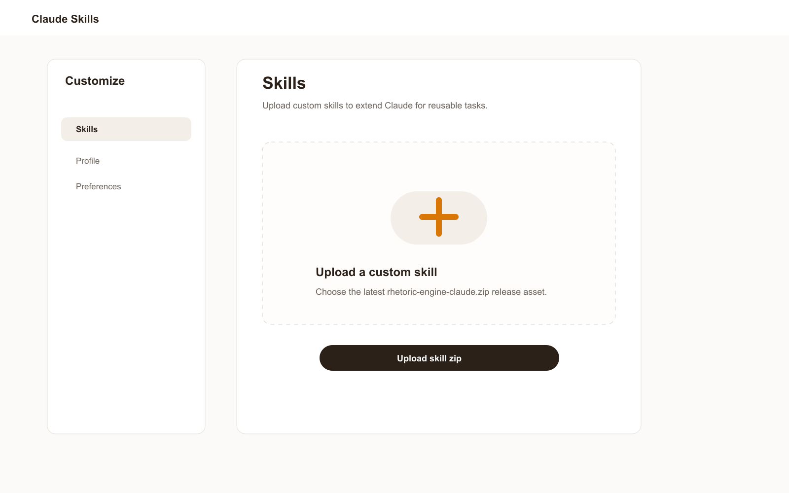

# Install Biolytics Rhetoric Engine

This guide gives copy-paste installation paths for common agent platforms. Use the native plugin/extension path when your platform supports it. Use the universal fallback when it does not.

## Repository

```bash
git clone https://github.com/Biolytics-AI/rhetoric-engine.git
cd rhetoric-engine
```

To update later:

```bash
git pull --ff-only
```

## ChatGPT Web And ChatGPT Agent Studio

There is no one-click install link for ChatGPT skills. Download the release artifact first, then upload it in the ChatGPT UI.

Download:

- [`rhetoric-engine.skill`](https://github.com/Biolytics-AI/rhetoric-engine/releases/latest/download/rhetoric-engine.skill)
- [`rhetoric-engine-chatgpt.zip`](https://github.com/Biolytics-AI/rhetoric-engine/releases/latest/download/rhetoric-engine-chatgpt.zip) as a zip fallback

### ChatGPT Web Skills

1. Open ChatGPT.
2. Open your profile menu.
3. Click `Skills`.
4. Click `New skill`.
5. Upload `rhetoric-engine.skill`.



### ChatGPT Agent Studio

1. Open your agent in ChatGPT Agent Studio.
2. Click `Add skill`.
3. Choose `Upload skill`.
4. Upload `rhetoric-engine.skill`.



## Claude Web

There is no one-click install link for Claude web skills. Download the release artifact first, then upload it in Claude.

Download:

- [`rhetoric-engine-claude.zip`](https://github.com/Biolytics-AI/rhetoric-engine/releases/latest/download/rhetoric-engine-claude.zip)

Install:

1. Open Claude.
2. Go to `Settings` / `Customize` / `Skills`.
3. Upload `rhetoric-engine-claude.zip`.



## OpenAI Codex

Rhetoric Engine ships with Codex plugin metadata in `.codex-plugin/plugin.json` and a Codex marketplace file in `.agents/plugins/marketplace.json`.

### Option A: Add The Biolytics Marketplace

Use this when your Codex environment supports plugin marketplaces.

```bash
codex plugin marketplace add Biolytics-AI/rhetoric-engine --ref main
```

Then install the plugin named:

```text
rhetoric-engine
```

from the Biolytics marketplace in Codex.

After installation, start a presentation task with:

```text
Use rhetorical-orchestrator to help me build this deck.
```

### Option B: Local Skills Fallback

Use this when plugin marketplaces are unavailable but local skills are supported.

```bash
mkdir -p ~/.codex/skills ~/.agents/skills
git clone https://github.com/Biolytics-AI/rhetoric-engine.git ~/rhetoric-engine
cp -R ~/rhetoric-engine/skills/* ~/.codex/skills/
cp -R ~/rhetoric-engine/skills/* ~/.agents/skills/
```

Restart Codex, then ask for:

```text
Use rhetorical-orchestrator for this presentation.
```

## Anthropic Claude Code

Rhetoric Engine ships with Claude Code plugin metadata in `.claude-plugin/plugin.json` and a marketplace file in `.claude-plugin/marketplace.json`.

### Option A: Add The Marketplace From GitHub

Run these commands in your terminal:

```bash
claude plugin marketplace add Biolytics-AI/rhetoric-engine
claude plugin install rhetoric-engine@biolytics
```

Start with:

```text
Use rhetorical-orchestrator to help me turn this presentation idea into a deck.
```

### Option B: Add The Marketplace From A Local Clone

Use this when you want to work from a local checkout:

```bash
git clone https://github.com/Biolytics-AI/rhetoric-engine.git ~/rhetoric-engine
claude plugin marketplace add ~/rhetoric-engine
claude plugin install rhetoric-engine@biolytics
```

### Option C: Add From Inside Claude Code

If you prefer Claude Code slash commands, run:

```text
/plugin marketplace add Biolytics-AI/rhetoric-engine
/plugin install rhetoric-engine@biolytics
```

### Option D: Skills-Only Fallback

If your Claude setup does not expose plugin marketplace commands, copy the skills into your Claude skills directory:

```bash
mkdir -p ~/.claude/skills
git clone https://github.com/Biolytics-AI/rhetoric-engine.git ~/rhetoric-engine
cp -R ~/rhetoric-engine/skills/* ~/.claude/skills/
```

Restart Claude Code, then invoke `rhetorical-orchestrator`.

## Google Gemini CLI

Rhetoric Engine ships as a Gemini CLI extension through `gemini-extension.json`, `GEMINI.md`, and the bundled `skills/` directory. Gemini CLI automatically discovers skills bundled with an extension.

### Option A: Install From GitHub

Run this from your terminal, not inside Gemini's interactive session:

```bash
gemini extensions install https://github.com/Biolytics-AI/rhetoric-engine --ref main
```

Restart Gemini CLI, then ask:

```text
Use Biolytics Rhetoric Engine to structure this presentation.
```

### Option B: Link A Local Clone

```bash
git clone https://github.com/Biolytics-AI/rhetoric-engine.git ~/rhetoric-engine
cd ~/rhetoric-engine
gemini extensions link .
```

Restart Gemini CLI after linking.

### Option C: Install From Local Path

```bash
git clone https://github.com/Biolytics-AI/rhetoric-engine.git ~/rhetoric-engine
gemini extensions install ~/rhetoric-engine
```

If your Gemini CLI version does not support extension installation yet, use the universal fallback below.

## OpenAI API, Anthropic API, Or Other Programmatic Agents

Use this when you are building your own agent with the OpenAI API, OpenAI Agents SDK, Anthropic API, Google Gemini API, LangGraph, LlamaIndex, CrewAI, or another framework.

1. Clone the repository or vendor the `skills/` directory into your app.
2. Load `skills/rhetorical-orchestrator/SKILL.md` into the agent's system or developer instructions for substantial presentation tasks.
3. Let the agent read the stage skill files on demand from `skills/<skill-name>/SKILL.md`.
4. Persist the artifact ledger in your app state so the agent can stop at approval gates.

Minimal system instruction:

```text
For substantial presentation work, use Biolytics Rhetoric Engine.
First read skills/rhetorical-orchestrator/SKILL.md.
Route to the named stage skills under skills/.
Do not compile or draft slides before the user has approved intent, insight, argument spine, and slide thesis map.
Preserve the user's point of view; do not replace it with a generic model-generated deck.
```

## Generic Agent Or Manual Setup

Use this path for ChatGPT custom GPTs/projects, Cursor, Windsurf, Roo Code, Cline, Aider, OpenCode, or any agent that can read files but does not have a plugin installer.

1. Clone the repository:

   ```bash
   git clone https://github.com/Biolytics-AI/rhetoric-engine.git
   ```

2. Add this instruction to the agent's system/developer instructions:

   ```text
   For substantial presentation work, use Biolytics Rhetoric Engine.
   First read skills/rhetorical-orchestrator/SKILL.md.
   Route to the named stage skills under skills/.
   Do not compile or draft slides before the user has approved intent, insight, argument spine, and slide thesis map.
   Preserve the user's point of view; do not replace it with a generic model-generated deck.
   ```

3. Give the agent filesystem access to the cloned repository or attach the relevant `SKILL.md` files.

4. Start with:

   ```text
   Use rhetorical-orchestrator for this presentation.
   ```

## Verify Installation

Ask the agent:

```text
What is the first gate in Biolytics Rhetoric Engine, and what artifacts must be approved before deck compilation?
```

A healthy install should answer that the first gate is intent framing and that deck compilation requires approved intent, insight, argument spine, and slide thesis map.

## Troubleshooting

- If the agent starts drafting slides immediately, explicitly invoke `rhetorical-orchestrator`.
- If only one stage is needed, invoke that skill by name, for example `content-distiller` or `delivery-coach`.
- If a platform cannot install plugins, use the universal fallback and expose the `skills/` directory as readable context.
- If instructions appear stale, run `git pull --ff-only` in the cloned repository and restart the agent.

## Platform References

- OpenAI Codex plugins: https://developers.openai.com/codex/plugins
- Anthropic Claude Code plugin marketplaces: https://code.claude.com/docs/en/plugin-marketplaces
- Gemini CLI extensions: https://github.com/google-gemini/gemini-cli/blob/main/docs/extensions/index.md
- Gemini CLI extension reference: https://github.com/google-gemini/gemini-cli/blob/main/docs/extensions/reference.md
